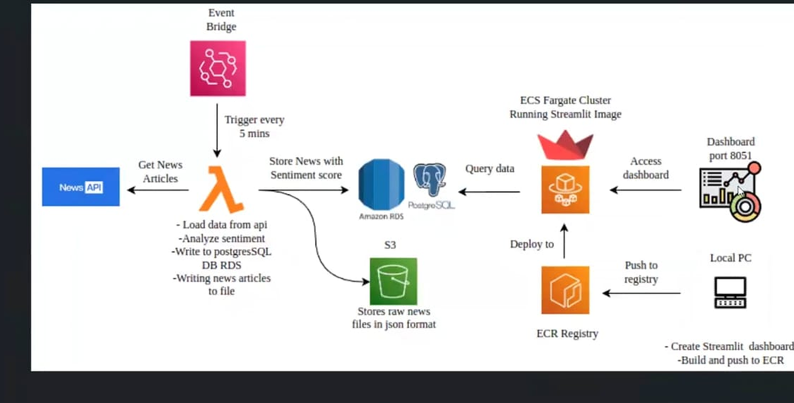

# News Sentiment Analytics Platform

A production-style cloud-native news analytics platform built using AWS services, containerized dashboard deployment, real-time ingestion pipelines, sentiment analysis, and interactive data visualization.

---

# Project Overview

This platform ingests news data from external APIs, processes and stores the data using AWS cloud infrastructure, performs sentiment analysis, and visualizes analytics through a live Streamlit dashboard deployed on Amazon ECS Fargate.

The project demonstrates practical implementation of:

* Cloud-native architecture
* Serverless data ingestion
* Containerized deployment
* Real-time analytics visualization
* AWS infrastructure orchestration
* Data engineering workflows
* Scalable dashboard deployment

---

# System Architecture

## Architecture Diagram



## High-Level Workflow

```text
News API
   ↓
AWS Lambda (Data Ingestion)
   ↓
Amazon S3 (Raw JSON Storage)
   ↓
AWS Lambda (Sentiment Processing)
   ↓
Amazon RDS PostgreSQL
   ↓
Streamlit Dashboard
   ↓
Amazon ECS Fargate
```

---

# AWS Services Used

| Service               | Purpose                             |
| --------------------- | ----------------------------------- |
| AWS Lambda            | Serverless ingestion and processing |
| Amazon S3             | Raw news data storage               |
| Amazon RDS PostgreSQL | Structured analytics database       |
| Amazon ECS Fargate    | Containerized dashboard hosting     |
| Amazon ECR            | Docker image registry               |
| Amazon CloudWatch     | Logging and monitoring              |
| IAM                   | Secure permissions management       |
| EC2 Networking        | Security groups and networking      |

---

# Key Features

## Real-Time News Ingestion

* Fetches live news articles from external APIs
* Serverless ingestion using AWS Lambda
* Automated storage of raw JSON data into Amazon S3

## Sentiment Analysis Pipeline

* Processes incoming news content
* Performs sentiment classification
* Stores structured results into PostgreSQL

## Interactive Analytics Dashboard

* Built using Streamlit
* Dynamic charts and sentiment visualizations
* Auto-refresh enabled for near real-time updates
* Publicly deployed using ECS Fargate

## Cloud-Native Deployment

* Fully containerized deployment using Docker
* Hosted on Amazon ECS Fargate
* Images stored in Amazon ECR
* Logs centralized with CloudWatch

---

# Tech Stack

## Programming Languages

* Python
* SQL

## Frameworks & Libraries

* Streamlit
* Pandas
* Plotly
* Psycopg2

## Cloud & DevOps

* AWS Lambda
* Amazon ECS Fargate
* Amazon ECR
* Amazon RDS
* Amazon S3
* Docker
* CloudWatch

---

# Project Structure

```text
news-sentiment-platform/
│
├── dashboard/
│   ├── app/
│   │   └── app.py
│   └── requirements.txt
│
├── infrastructure/
│   └── docker/
│       └── Dockerfile
│
├── lambda/
│   ├── ingestion/
│   └── sentiment/
│
├── task-definition.json
├── README.md
└── .gitignore
```

---

# Docker Deployment

## Build Docker Image

```bash
docker build -t news-streamlit-dashboard -f infrastructure/docker/Dockerfile .
```

## Tag Docker Image

```bash
docker tag news-streamlit-dashboard:latest <ECR_REPOSITORY_URI>:latest
```

## Push to Amazon ECR

```bash
docker push <ECR_REPOSITORY_URI>:latest
```

---

# ECS Fargate Deployment

## Register Task Definition

```bash
aws ecs register-task-definition --cli-input-json file://task-definition.json --region ap-south-1
```

## Update ECS Service

```bash
aws ecs update-service \
--cluster news-streamlit-cluster \
--service news-streamlit-service \
--task-definition news-streamlit-task \
--force-new-deployment \
--region ap-south-1
```

---

# Dashboard Features

The dashboard provides:

* News sentiment distribution
* Sentiment trend analysis
* Source-based analytics
* Interactive filtering
* Live database connectivity
* Real-time refresh functionality

---

# Database

## Amazon RDS PostgreSQL

The processed sentiment records are stored in PostgreSQL hosted on Amazon RDS.

### Stored Fields

* News ID
* Source name
* Author
* Title
* Description
* Published date
* Sentiment label
* Sentiment score
* URL

---

# Logging & Monitoring

Amazon CloudWatch is used for:

* ECS container logs
* Lambda execution logs
* Runtime debugging
* Monitoring deployment health

---

# Security Considerations

Implemented:

* IAM execution roles
* ECS security groups
* Controlled port exposure
* Private database connectivity

Recommended production improvements:

* AWS Secrets Manager
* HTTPS with Application Load Balancer
* Custom domain via Route53
* WAF integration
* CI/CD automation

---

# Challenges Solved

## ECS Networking Issues

* Resolved subnet and security group VPC mismatches
* Configured public networking for Fargate

## Container Deployment

* Fixed Docker build path issues
* Resolved Streamlit startup configuration
* Corrected ECS task definition execution commands

## Cloud Integration

* Established end-to-end AWS workflow
* Integrated RDS with live dashboard access
* Centralized logs using CloudWatch


# Author

## Sreelakshmi TK

B.Tech Artificial Intelligence and Data Science

Focused on:

* Cloud Computing
* Data Engineering
* Machine Learning
* AI Systems
* Analytics Platforms

